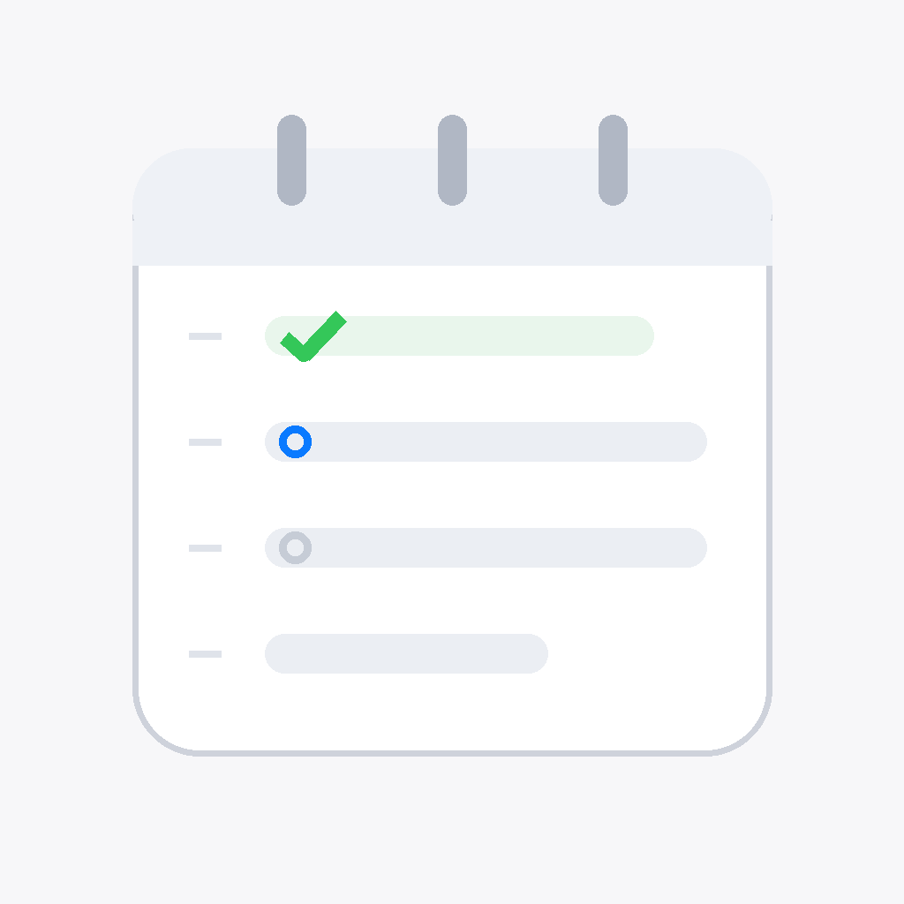
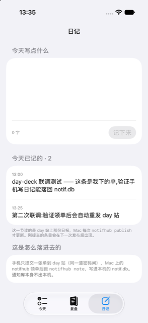

<p align="center"></p>

# 每日复盘 · day-deck

**零推送零打扰——早看该做什么，晚看发生了什么。**

    

「我主要是为了复盘，不用提醒我」——所以它没有推送、没有本地通知、没有角标，在提醒类 app 里逆行。手机只下单，真正的执行都在桌面端排队完成。

<table><tr>
<td align="center" width="25%"><br><sub>日记：手机上写一条，落回桌面端的通知库——通知库本身不出本机</sub></td>
</tr></table>

## 它做什么

| 功能 | 说明 |
|---|---|
| **早看要做什么，晚看发生了什么** | 今天页按逾期/今天/没定时间分组，跨天未完成的事不会消失；复盘页是 LLM 生成的当日 headline + 几条线 + 时间线，可往回翻任意一天。 |
| **零推送、零角标、零打扰** | 在提醒类 app 里逆行：没有推送、没有本地通知、没有角标。「我主要是为了复盘，不用提醒我」——它等你想看的时候来，不来找你。 |
| **写只下单，执行都在桌面端** | 手机上标完成、写日记，其实是往队列里投一张单；桌面端领单执行、回写状态。所以界面上一律说「已排队」不说「已完成」——中间隔着另一台机器醒没醒，如实说。 |

## 怎么拿到

个人专属（内容是本人生活流），不开放安装。

薄壳，读写都走私有后端 `day.tianli.cyou`（访问闸后，内容是作者本人的生活流）。代码可读可编，没有账号跑不出数据。

## 构建

```bash
brew install xcodegen
xcodegen generate
xcodebuild -scheme DayDeck -destination 'generic/platform=iOS Simulator' build
```

- 仓里的 `*.sh` 是作者本机舰队脚本的 shim（三平台构建 / 真机装机 / TestFlight），依赖 `~/Dev` 下的总部工具，不在本仓；没有那套工具时它们会明确退出。
- `Shared/PlatformCompat.swift` 是总部共享文件的逐字节副本（iOS-only SwiftUI 修饰符在 macOS 侧的同名 no-op），别在这里改它。

开发细节（回归、验证通道、约束）见 [DEVELOPING.md](DEVELOPING.md)。

## 相关

- 产品页：<https://apps.tianli.cyou/p/day-deck-ios.html>
- 舰队总览（10 个 app 怎么来的）：<https://apps.tianli.cyou/ios.html>
- 教程：[从零到 TestFlight：一个人做 iPhone app 的完整路径](https://blog-ai.tianli.cyou/nine-ios-apps-in-two-weeks)

## License

MIT © 2026 曾田力 (Tianli Zeng)
